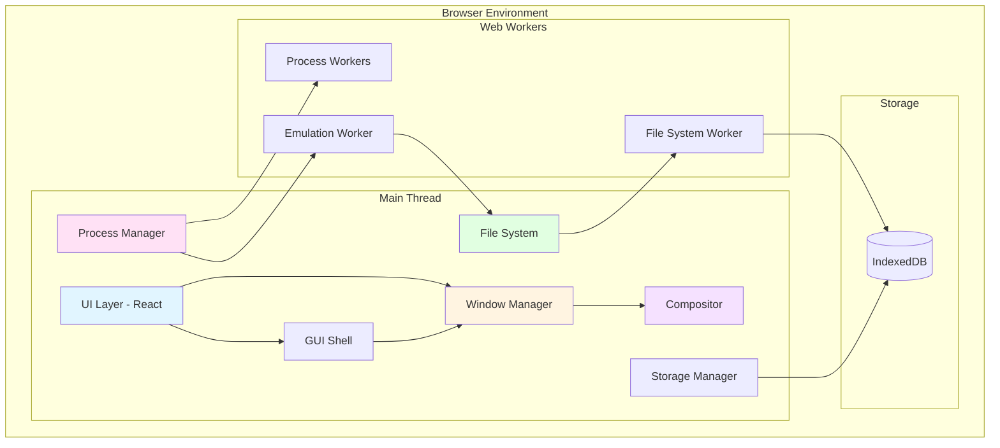
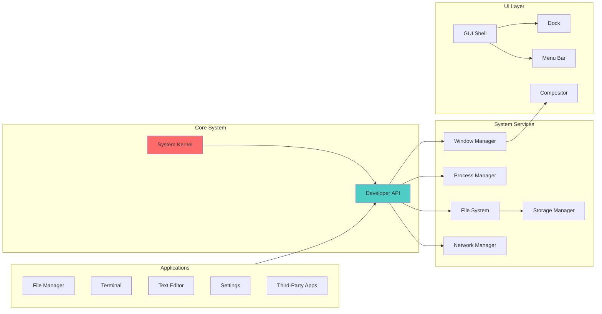
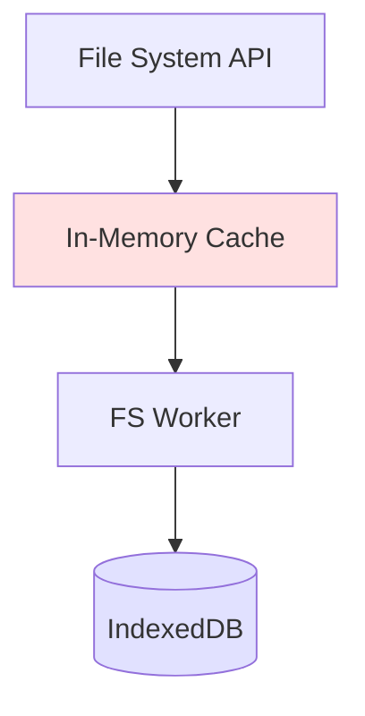
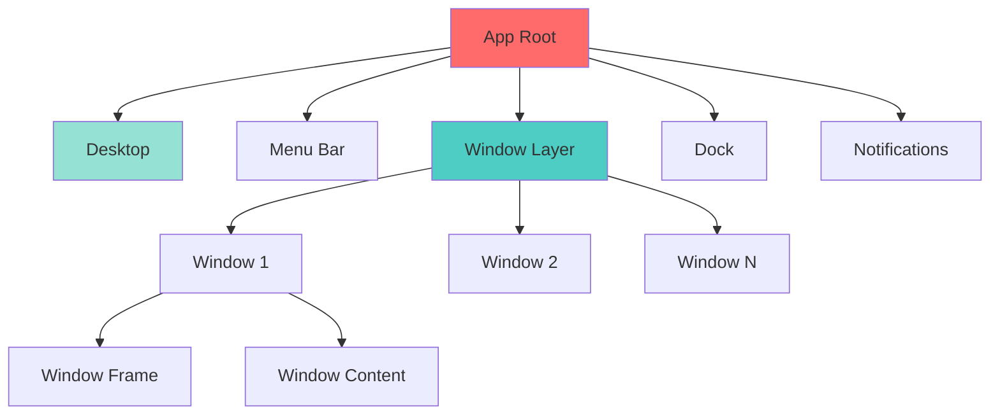

# Design Document: Browser OS

## Overview

Browser OS is a full-featured operating system that runs entirely within a web browser, providing a complete desktop environment with window management, file system, process management, and x86/x64 emulation capabilities. The system leverages modern web technologies including TypeScript, React, and WebAssembly to deliver a native-like operating system experience.

### Design Goals

1. **Browser-Native Architecture**: Utilize web platform APIs (IndexedDB, Web Workers, WebAssembly) for maximum compatibility
2. **Performance**: Achieve 60 FPS UI rendering and sub-100ms response times for user interactions
3. **Modularity**: Design loosely-coupled components with well-defined interfaces
4. **Extensibility**: Enable third-party application development through comprehensive APIs
5. **Security**: Implement sandboxing and permission-based access control
6. **Persistence**: Maintain state across browser sessions using IndexedDB

### Technology Stack

- **Language**: TypeScript 5.x for type safety and developer experience
- **UI Framework**: React 18.x with hooks for component management
- **State Management**: Zustand for global state, React Context for component state
- **Storage**: IndexedDB via idb library for persistent storage
- **Emulation**: v86 for x86 emulation, integrated via WebAssembly
- **Build Tool**: Vite for fast development and optimized production builds
- **Styling**: Tailwind CSS with custom design system for macOS-inspired aesthetics
- **Animation**: Framer Motion for smooth transitions and effects
- **Worker Management**: Comlink for simplified Web Worker communication

## Architecture

### High-Level System Architecture



### Component Architecture



### Thread Architecture

Browser OS uses a multi-threaded architecture to maintain UI responsiveness:

- **Main Thread**: UI rendering, event handling, window management, compositor
- **File System Worker**: File I/O operations, IndexedDB transactions
- **Emulation Worker**: x86/x64 instruction execution (isolated per process)
- **Process Workers**: Application execution contexts (one per application)

## Components and Interfaces

### 1. System Kernel

The kernel is the central coordinator that initializes and manages all system components.

**Responsibilities:**
- System initialization and bootstrap
- Component lifecycle management
- Global event bus coordination
- System-wide error handling

**Interface:**

```typescript
interface ISystemKernel {
  // Lifecycle
  initialize(): Promise<void>;
  shutdown(): Promise<void>;
  
  // Component registry
  registerComponent(name: string, component: ISystemComponent): void;
  getComponent<T>(name: string): T;
  
  // Event bus
  emit(event: SystemEvent): void;
  on(eventType: string, handler: EventHandler): void;
  off(eventType: string, handler: EventHandler): void;
}

interface ISystemComponent {
  name: string;
  initialize(): Promise<void>;
  shutdown(): Promise<void>;
}

interface SystemEvent {
  type: string;
  timestamp: number;
  data: any;
}
```

### 2. File System

The file system provides a POSIX-like hierarchical file system with in-memory caching and IndexedDB persistence.

**Architecture:**



**Responsibilities:**
- File and directory CRUD operations
- Path resolution and validation
- Permission enforcement
- Metadata management
- Caching strategy for performance

**Interface:**

```typescript
interface IFileSystem {
  // File operations
  readFile(path: string): Promise<Uint8Array>;
  writeFile(path: string, data: Uint8Array): Promise<void>;
  deleteFile(path: string): Promise<void>;
  
  // Directory operations
  readDir(path: string): Promise<FileEntry[]>;
  createDir(path: string): Promise<void>;
  deleteDir(path: string, recursive?: boolean): Promise<void>;
  
  // Metadata operations
  stat(path: string): Promise<FileStats>;
  chmod(path: string, mode: number): Promise<void>;
  
  // Path operations
  exists(path: string): Promise<boolean>;
  rename(oldPath: string, newPath: string): Promise<void>;
  copy(srcPath: string, destPath: string): Promise<void>;
  move(srcPath: string, destPath: string): Promise<void>;
  
  // Import/Export
  importFile(file: File, destPath: string): Promise<void>;
  exportFile(path: string): Promise<Blob>;
  
  // Watch
  watch(path: string, callback: FileWatchCallback): WatchHandle;
  unwatch(handle: WatchHandle): void;
}

interface FileEntry {
  name: string;
  path: string;
  type: 'file' | 'directory';
  size: number;
  createdAt: Date;
  modifiedAt: Date;
  permissions: FilePermissions;
}

interface FileStats {
  size: number;
  createdAt: Date;
  modifiedAt: Date;
  accessedAt: Date;
  permissions: FilePermissions;
  isDirectory: boolean;
  isFile: boolean;
}

interface FilePermissions {
  read: boolean;
  write: boolean;
  execute: boolean;
}
```


### 3. Process Manager

The process manager handles application lifecycle, resource allocation, and inter-process communication.

**Responsibilities:**
- Process creation and termination
- Process state management
- Resource limits enforcement
- Inter-process communication (IPC)
- Process isolation

**Interface:**

```typescript
interface IProcessManager {
  // Process lifecycle
  spawn(executable: string, args: string[], options?: SpawnOptions): Promise<Process>;
  kill(pid: number, signal?: Signal): Promise<void>;
  
  // Process queries
  getProcess(pid: number): Process | null;
  listProcesses(): Process[];
  
  // IPC
  sendMessage(pid: number, message: IPCMessage): Promise<void>;
  onMessage(pid: number, handler: MessageHandler): void;
}

interface Process {
  pid: number;
  name: string;
  state: ProcessState;
  parentPid: number | null;
  startTime: Date;
  memoryUsage: number;
  cpuUsage: number;
}

enum ProcessState {
  RUNNING = 'running',
  PAUSED = 'paused',
  TERMINATED = 'terminated',
}

interface SpawnOptions {
  cwd?: string;
  env?: Record<string, string>;
  memoryLimit?: number;
  windowOptions?: WindowOptions;
}
```


### 4. Window Manager

The window manager controls window lifecycle, positioning, z-ordering, and user interactions.

**Responsibilities:**
- Window creation and destruction
- Window positioning and sizing
- Z-order management
- Window state transitions (minimize, maximize, restore)
- Window decorations rendering
- Drag and resize handling

**Interface:**

```typescript
interface IWindowManager {
  // Window lifecycle
  createWindow(options: WindowOptions): Window;
  closeWindow(windowId: string): void;
  
  // Window state
  minimizeWindow(windowId: string): void;
  maximizeWindow(windowId: string): void;
  restoreWindow(windowId: string): void;
  
  // Window positioning
  moveWindow(windowId: string, x: number, y: number): void;
  resizeWindow(windowId: string, width: number, height: number): void;
  
  // Z-order
  focusWindow(windowId: string): void;
  getActiveWindow(): Window | null;
  
  // Queries
  getWindow(windowId: string): Window | null;
  listWindows(): Window[];
}

interface Window {
  id: string;
  title: string;
  x: number;
  y: number;
  width: number;
  height: number;
  minWidth: number;
  minHeight: number;
  zIndex: number;
  state: WindowState;
  processId: number;
  resizable: boolean;
  movable: boolean;
  closable: boolean;
  minimizable: boolean;
  maximizable: boolean;
}


enum WindowState {
  NORMAL = 'normal',
  MINIMIZED = 'minimized',
  MAXIMIZED = 'maximized',
  FULLSCREEN = 'fullscreen',
}

interface WindowOptions {
  title: string;
  width: number;
  height: number;
  x?: number;
  y?: number;
  minWidth?: number;
  minHeight?: number;
  resizable?: boolean;
  movable?: boolean;
  closable?: boolean;
  minimizable?: boolean;
  maximizable?: boolean;
  transparent?: boolean;
  frame?: boolean;
}
```

### 5. Compositor

The compositor handles visual effects, animations, and efficient rendering of the window hierarchy.

**Responsibilities:**
- Hardware-accelerated rendering
- Window shadow and blur effects
- Animation orchestration
- Transparency and alpha blending
- Performance optimization (minimize repaints)

**Interface:**

```typescript
interface ICompositor {
  // Rendering
  render(): void;
  invalidate(windowId?: string): void;
  
  // Effects
  setWindowShadow(windowId: string, shadow: ShadowConfig): void;
  setWindowOpacity(windowId: string, opacity: number): void;
  
  // Animations
  animate(windowId: string, animation: Animation): Promise<void>;
  cancelAnimation(windowId: string): void;
}


interface ShadowConfig {
  offsetX: number;
  offsetY: number;
  blur: number;
  color: string;
}

interface Animation {
  property: string;
  from: any;
  to: any;
  duration: number;
  easing: EasingFunction;
}
```

### 6. GUI Shell

The GUI shell provides the desktop environment including dock, menu bar, and desktop.

**Responsibilities:**
- Desktop rendering and wallpaper
- Dock management
- Menu bar rendering
- System tray
- Notification system

**Interface:**

```typescript
interface IGUIShell {
  // Desktop
  setWallpaper(imageUrl: string): void;
  getWallpaper(): string;
  
  // Dock
  addDockItem(item: DockItem): void;
  removeDockItem(itemId: string): void;
  updateDockItem(itemId: string, updates: Partial<DockItem>): void;
  
  // Notifications
  showNotification(notification: Notification): void;
  
  // Menu
  setMenuBar(menu: MenuBar): void;
}

interface DockItem {
  id: string;
  icon: string;
  label: string;
  executable?: string;
  processId?: number;
  pinned: boolean;
  running: boolean;
}


interface Notification {
  title: string;
  message: string;
  icon?: string;
  duration?: number;
  actions?: NotificationAction[];
}
```

### 7. Storage Manager

The storage manager handles persistent storage using IndexedDB with efficient caching.

**Responsibilities:**
- IndexedDB transaction management
- Data serialization/deserialization
- Storage quota monitoring
- Cache invalidation strategy

**Interface:**

```typescript
interface IStorageManager {
  // Storage operations
  set(key: string, value: any): Promise<void>;
  get(key: string): Promise<any>;
  delete(key: string): Promise<void>;
  clear(): Promise<void>;
  
  // Batch operations
  setBatch(entries: [string, any][]): Promise<void>;
  getBatch(keys: string[]): Promise<any[]>;
  
  // Quota
  getQuota(): Promise<StorageQuota>;
  
  // Persistence
  persist(): Promise<boolean>;
}

interface StorageQuota {
  usage: number;
  quota: number;
  available: number;
}
```

### 8. Emulation Layer

The emulation layer provides x86/x64 instruction execution using v86.

**Responsibilities:**
- CPU emulation
- Memory management
- System call translation
- I/O device emulation
- Integration with file system

**Interface:**

```typescript
interface IEmulator {
  // Lifecycle
  initialize(config: EmulatorConfig): Promise<void>;
  start(): void;
  stop(): void;
  reset(): void;
  
  // Execution
  loadExecutable(path: string): Promise<void>;
  
  // State
  getState(): EmulatorState;
  saveState(): Promise<EmulatorSnapshot>;
  restoreState(snapshot: EmulatorSnapshot): Promise<void>;
  
  // I/O
  sendInput(input: InputEvent): void;
  onOutput(handler: OutputHandler): void;
}

interface EmulatorConfig {
  memory: number;
  biosUrl: string;
  vgaBiosUrl: string;
  bootOrder: number;
}

interface EmulatorState {
  running: boolean;
  cpuUsage: number;
  memoryUsage: number;
}
```

### 9. Terminal

The terminal provides a command-line interface with shell capabilities.

**Responsibilities:**
- Command parsing and execution
- Built-in command implementation
- Command history management
- Tab completion
- ANSI escape code rendering

**Interface:**

```typescript
interface ITerminal {
  // Execution
  execute(command: string): Promise<CommandResult>;
  
  // History
  getHistory(): string[];
  clearHistory(): void;
  
  // Completion
  complete(partial: string): string[];
  
  // Environment
  setEnv(key: string, value: string): void;
  getEnv(key: string): string | undefined;
  getCwd(): string;
  setCwd(path: string): void;
}


interface CommandResult {
  exitCode: number;
  stdout: string;
  stderr: string;
}
```

## Data Models

### File System Data Model

**IndexedDB Schema:**

```typescript
// Database: browser-os-fs
// Version: 1

// Object Store: files
interface FileRecord {
  path: string;           // Primary key
  name: string;
  type: 'file' | 'directory';
  parentPath: string;     // Indexed
  data?: Uint8Array;      // Only for files
  size: number;
  createdAt: number;
  modifiedAt: number;
  accessedAt: number;
  permissions: {
    read: boolean;
    write: boolean;
    execute: boolean;
  };
}

// Object Store: metadata
interface MetadataRecord {
  key: string;            // Primary key
  value: any;
}
```

**In-Memory Cache Structure:**

```typescript
interface FileSystemCache {
  // LRU cache for file contents
  fileCache: Map<string, CacheEntry<Uint8Array>>;
  
  // Directory listing cache
  dirCache: Map<string, CacheEntry<FileEntry[]>>;
  
  // Metadata cache
  statCache: Map<string, CacheEntry<FileStats>>;
}

interface CacheEntry<T> {
  data: T;
  timestamp: number;
  accessCount: number;
}
```


### Process Data Model

```typescript
interface ProcessRecord {
  pid: number;
  name: string;
  executable: string;
  args: string[];
  state: ProcessState;
  parentPid: number | null;
  startTime: number;
  endTime: number | null;
  
  // Resources
  memoryLimit: number;
  memoryUsage: number;
  cpuUsage: number;
  
  // Context
  cwd: string;
  env: Record<string, string>;
  
  // IPC
  messageQueue: IPCMessage[];
  
  // Associated window
  windowId: string | null;
  
  // Worker reference
  worker: Worker | null;
}

interface IPCMessage {
  from: number;
  to: number;
  type: string;
  data: any;
  timestamp: number;
}
```

### Window Data Model

```typescript
interface WindowRecord {
  id: string;
  processId: number;
  
  // Position and size
  x: number;
  y: number;
  width: number;
  height: number;
  minWidth: number;
  minHeight: number;
  
  // State
  state: WindowState;
  zIndex: number;
  focused: boolean;
  
  // Appearance
  title: string;
  icon: string;
  transparent: boolean;
  opacity: number;
  shadow: ShadowConfig;
  
  // Behavior
  resizable: boolean;
  movable: boolean;
  closable: boolean;
  minimizable: boolean;
  maximizable: boolean;
  
  // Content
  contentUrl: string;
}
```


### Application Package Data Model

```typescript
interface AppPackage {
  manifest: AppManifest;
  files: Map<string, Uint8Array>;
}

interface AppManifest {
  name: string;
  version: string;
  author: string;
  description: string;
  icon: string;
  
  // Entry point
  main: string;
  
  // Permissions
  permissions: Permission[];
  
  // Dependencies
  dependencies: Record<string, string>;
  
  // Window configuration
  window?: WindowOptions;
  
  // Categories
  categories: string[];
}

enum Permission {
  FILE_READ = 'file:read',
  FILE_WRITE = 'file:write',
  NETWORK = 'network',
  PROCESS_SPAWN = 'process:spawn',
  SYSTEM_INFO = 'system:info',
}
```

### System Configuration Data Model

**IndexedDB Schema:**

```typescript
// Database: browser-os-config
// Version: 1

// Object Store: settings
interface SettingRecord {
  key: string;            // Primary key
  value: any;
  category: string;       // Indexed
  type: 'string' | 'number' | 'boolean' | 'object';
}

// Object Store: applications
interface InstalledAppRecord {
  id: string;             // Primary key
  manifest: AppManifest;
  installPath: string;
  installedAt: number;
  lastUsed: number;
}
```


## Technical Decisions

### 1. x86/x64 Emulation Strategy

**Decision**: Use v86 emulator integrated via WebAssembly

**Rationale:**
- v86 is a mature, well-tested x86 emulator written in JavaScript/WebAssembly
- Supports running real operating systems (Linux, Windows 98, FreeDOS)
- Active development and community support
- Can be integrated as a Web Worker for isolation

**Implementation Approach:**
1. Run v86 in a dedicated Web Worker per emulated process
2. Provide a virtual disk backed by Browser OS file system
3. Translate Windows API calls to Browser OS equivalents where possible
4. Use FreeDOS or minimal Linux as the base OS for running executables
5. Implement a compatibility layer for common Windows system calls

**Performance Considerations:**
- Emulation will be significantly slower than native execution (10-100x)
- Limit emulated processes to one at a time to conserve resources
- Provide clear performance expectations to users
- Consider JIT compilation for frequently executed code paths

**Alternative Considered**: box86/box64
- Rejected due to complexity of porting to WebAssembly
- v86 has better browser integration

### 2. File System Architecture

**Decision**: Hybrid in-memory cache + IndexedDB persistence

**Rationale:**
- IndexedDB provides persistent storage but has async API overhead
- In-memory cache provides fast synchronous access for frequently used files
- LRU eviction prevents unbounded memory growth

**Cache Strategy:**
- Cache file contents up to 10MB per file
- Cache directory listings for all accessed directories
- Cache file metadata (stats) for all accessed files
- Evict least recently used entries when cache exceeds 100MB
- Write-through cache: writes go to both cache and IndexedDB

**IndexedDB Schema Design:**
- Single object store for files with path as primary key
- Index on parentPath for efficient directory listing
- Store file data as Uint8Array for binary compatibility
- Separate metadata store for system configuration


### 3. Process Isolation

**Decision**: Use Web Workers for process isolation

**Rationale:**
- Web Workers provide true parallelism and memory isolation
- Each application runs in its own worker context
- Prevents one application from blocking the UI or other applications
- Natural fit for sandboxing and security

**Implementation:**
- Main thread manages process lifecycle and IPC
- Each process gets a dedicated Web Worker
- Communication via postMessage with structured cloning
- Use Comlink library to simplify RPC-style communication
- Shared memory (SharedArrayBuffer) for high-performance data sharing when needed

**Limitations:**
- Workers cannot directly access DOM (applications must use virtual DOM or message-based rendering)
- Serialization overhead for large data transfers
- Limited to ~20-30 workers in most browsers

### 4. Window Rendering Strategy

**Decision**: CSS-based rendering with hardware acceleration

**Rationale:**
- CSS transforms and transitions are hardware-accelerated
- Simpler than WebGL-based rendering
- Better accessibility and developer experience
- Sufficient performance for desktop UI

**Implementation:**
- Each window is a positioned div with CSS transforms
- Use `will-change` and `transform: translateZ(0)` for GPU acceleration
- Compositor manages z-index and stacking context
- Framer Motion for smooth animations
- Virtual scrolling for window content when needed

**Alternative Considered**: WebGL-based compositor
- Rejected due to complexity and accessibility concerns
- May revisit for advanced effects in future versions


### 5. State Management

**Decision**: Zustand for global state, React Context for component state

**Rationale:**
- Zustand provides simple, performant global state without boilerplate
- React Context for component-local state avoids prop drilling
- Avoid Redux complexity for this use case
- Easy to integrate with React hooks

**State Structure:**
```typescript
interface GlobalState {
  // System
  kernel: KernelState;
  
  // Components
  fileSystem: FileSystemState;
  processManager: ProcessManagerState;
  windowManager: WindowManagerState;
  
  // UI
  shell: ShellState;
  theme: ThemeState;
  
  // User
  settings: SettingsState;
}
```

### 6. Application Development Model

**Decision**: JavaScript/TypeScript modules with optional WebAssembly

**Rationale:**
- Leverage existing web development ecosystem
- TypeScript provides type safety and excellent tooling
- WebAssembly for performance-critical code
- Easy distribution via npm or custom package format

**Application Structure:**
```
my-app/
├── manifest.json
├── src/
│   ├── index.ts        # Entry point
│   ├── components/     # React components
│   ├── lib/           # Business logic
│   └── assets/        # Icons, images
└── dist/              # Built output
```

**API Access:**
- Applications import Browser OS API from `@browser-os/api`
- API provides typed interfaces for all system services
- Permissions checked at runtime based on manifest


### 7. Security Model

**Decision**: Permission-based sandboxing with explicit user consent

**Rationale:**
- Similar to mobile OS permission models (familiar to users)
- Applications declare required permissions in manifest
- User grants permissions at install time or first use
- System enforces permissions at API boundaries

**Permission Categories:**
- File system access (read/write specific paths)
- Network access (specific domains or all)
- Process spawning
- System information access
- Inter-process communication

**Enforcement:**
- API layer checks permissions before executing operations
- Web Worker isolation prevents direct memory access
- Content Security Policy for web-based applications
- Sandboxed iframes for untrusted content

## Project Structure

```
browser-os/
├── packages/
│   ├── kernel/              # System kernel
│   │   ├── src/
│   │   │   ├── kernel.ts
│   │   │   ├── event-bus.ts
│   │   │   └── component-registry.ts
│   │   └── package.json
│   │
│   ├── file-system/         # File system implementation
│   │   ├── src/
│   │   │   ├── file-system.ts
│   │   │   ├── cache.ts
│   │   │   ├── storage.ts
│   │   │   └── worker/
│   │   │       └── fs-worker.ts
│   │   └── package.json
│   │
│   ├── process-manager/     # Process management
│   │   ├── src/
│   │   │   ├── process-manager.ts
│   │   │   ├── process.ts
│   │   │   └── ipc.ts
│   │   └── package.json
│   │
│   ├── window-manager/      # Window management
│   │   ├── src/
│   │   │   ├── window-manager.ts
│   │   │   ├── window.ts
│   │   │   └── compositor.ts
│   │   └── package.json
│   │
│   ├── gui-shell/           # GUI shell
│   │   ├── src/
│   │   │   ├── components/
│   │   │   │   ├── Desktop.tsx
│   │   │   │   ├── Dock.tsx
│   │   │   │   ├── MenuBar.tsx
│   │   │   │   └── Window.tsx
│   │   │   └── shell.ts
│   │   └── package.json
│   │
│   ├── emulator/            # x86/x64 emulation
│   │   ├── src/
│   │   │   ├── emulator.ts
│   │   │   ├── v86-wrapper.ts
│   │   │   └── worker/
│   │   │       └── emulator-worker.ts
│   │   └── package.json
│   │
│   ├── terminal/            # Terminal implementation
│   │   ├── src/
│   │   │   ├── terminal.ts
│   │   │   ├── shell.ts
│   │   │   ├── commands/
│   │   │   └── components/
│   │   │       └── Terminal.tsx
│   │   └── package.json
│   │
│   ├── api/                 # Developer API
│   │   ├── src/
│   │   │   ├── index.ts
│   │   │   ├── fs-api.ts
│   │   │   ├── process-api.ts
│   │   │   ├── window-api.ts
│   │   │   └── types.ts
│   │   └── package.json
│   │
│   └── apps/                # Built-in applications
│       ├── file-manager/
│       ├── text-editor/
│       ├── terminal-app/
│       ├── settings/
│       └── task-manager/
│
├── src/                     # Main application
│   ├── main.tsx            # Entry point
│   ├── App.tsx             # Root component
│   └── bootstrap.ts        # System initialization
│
├── public/
│   ├── bios/               # BIOS files for emulator
│   └── assets/
│
└── package.json
```


## IndexedDB Storage Schema

### Database: browser-os-fs

**Version**: 1

**Object Stores:**

1. **files**
   - **Key Path**: `path`
   - **Indexes**:
     - `parentPath`: For efficient directory listing
     - `type`: For filtering files vs directories
   - **Structure**: See FileRecord in Data Models section

2. **metadata**
   - **Key Path**: `key`
   - **Structure**: Key-value pairs for system metadata

**Usage Patterns:**
- Read file: Get by path from `files` store
- List directory: Query `files` store by `parentPath` index
- Write file: Put to `files` store with updated `modifiedAt`
- Delete file: Delete from `files` store
- Recursive delete: Query children by `parentPath`, delete recursively

### Database: browser-os-config

**Version**: 1

**Object Stores:**

1. **settings**
   - **Key Path**: `key`
   - **Indexes**:
     - `category`: For grouping related settings
   - **Structure**: See SettingRecord in Data Models section

2. **applications**
   - **Key Path**: `id`
   - **Indexes**:
     - `lastUsed`: For sorting by recent usage
   - **Structure**: See InstalledAppRecord in Data Models section

3. **sessions**
   - **Key Path**: `timestamp`
   - **Structure**:
     ```typescript
     interface SessionRecord {
       timestamp: number;
       windows: WindowRecord[];
       processes: ProcessRecord[];
     }
     ```

**Usage Patterns:**
- Save session: Put current state to `sessions` store
- Restore session: Get latest session from `sessions` store
- Get setting: Get by key from `settings` store
- List apps: Get all from `applications` store


## GUI Architecture and Compositor

### Component Hierarchy



### Rendering Pipeline

1. **State Update**: Component state changes (window moved, created, etc.)
2. **React Reconciliation**: React determines what changed
3. **DOM Update**: React updates the DOM
4. **Compositor Layer**: CSS transforms applied for positioning
5. **Browser Compositing**: Browser's compositor handles final rendering

### Window Rendering

Each window is rendered as:

```tsx
<div 
  className="window"
  style={{
    transform: `translate3d(${x}px, ${y}px, 0)`,
    width: `${width}px`,
    height: `${height}px`,
    zIndex: zIndex,
    opacity: opacity,
    willChange: 'transform',
  }}
>
  <WindowFrame />
  <WindowContent />
</div>
```

**Performance Optimizations:**
- Use `transform` instead of `left/top` for GPU acceleration
- `will-change: transform` hints browser to optimize
- `translate3d` forces GPU layer creation
- Minimize repaints by batching updates
- Use `React.memo` for window components
- Virtual scrolling for window content


### Shadow and Blur Effects

**Implementation**: CSS `filter` and `box-shadow`

```css
.window {
  box-shadow: 
    0 10px 40px rgba(0, 0, 0, 0.2),
    0 2px 8px rgba(0, 0, 0, 0.1);
  filter: drop-shadow(0 0 20px rgba(0, 0, 0, 0.15));
}

.window-blur-background {
  backdrop-filter: blur(20px);
  background: rgba(255, 255, 255, 0.8);
}
```

**Performance Considerations:**
- `backdrop-filter` is expensive; use sparingly
- Limit number of windows with blur effects
- Disable effects on low-end devices (feature detection)

### Animation System

**Library**: Framer Motion

**Common Animations:**

```typescript
// Window open
const openAnimation = {
  initial: { scale: 0.8, opacity: 0 },
  animate: { scale: 1, opacity: 1 },
  transition: { duration: 0.2, ease: 'easeOut' }
};

// Window minimize
const minimizeAnimation = {
  animate: { 
    scale: 0,
    x: dockIconX - windowX,
    y: dockIconY - windowY,
  },
  transition: { duration: 0.3, ease: 'easeInOut' }
};

// Window maximize
const maximizeAnimation = {
  animate: { 
    x: 0, 
    y: 0, 
    width: screenWidth, 
    height: screenHeight 
  },
  transition: { duration: 0.2, ease: 'easeOut' }
};
```

### Dock Implementation

**Visual Design:**
- Translucent background with blur
- Icon magnification on hover (scale 1.0 → 1.5)
- Smooth spring animations
- Running indicator (dot below icon)

**Interaction:**
- Click: Launch or focus application
- Right-click: Context menu
- Drag: Reorder icons
- Drag from Finder: Pin application

```tsx
<motion.div
  className="dock-icon"
  whileHover={{ scale: 1.5 }}
  whileTap={{ scale: 0.95 }}
  transition={{ type: 'spring', stiffness: 300 }}
>
  
  {running && <div className="running-indicator" />}
</motion.div>
```


## Correctness Properties

**Property-based testing is not applicable to Browser OS** for the following reasons:

1. **UI-Heavy System**: The majority of Browser OS functionality involves UI rendering, window management, visual effects, and compositor operations. These are best validated through snapshot tests, visual regression tests, and user interaction tests rather than property-based testing.

2. **Infrastructure Components**: Core components like the file system, process manager, and storage manager are infrastructure-level systems that integrate with browser APIs (IndexedDB, Web Workers). These are better tested with integration tests using real browser APIs rather than property-based tests.

3. **External Service Integration**: The x86/x64 emulation layer integrates with the v86 emulator library. Testing this integration requires integration tests with the actual emulator rather than property-based tests.

4. **Side-Effect Heavy Operations**: Most Browser OS operations involve side effects - file I/O to IndexedDB, process spawning with Web Workers, window creation in the DOM, network requests. Property-based testing is designed for pure functions with clear input/output relationships, not side-effect heavy operations.

5. **Configuration and State Management**: System initialization, component wiring, settings management, and session persistence are configuration concerns better tested with example-based unit tests and integration tests.

**Testing Approach**: Instead of property-based testing, Browser OS will use:
- **Unit tests** for business logic (path validation, permission checking, command parsing)
- **Integration tests** for component interactions (file system + IndexedDB, process manager + Web Workers)
- **Component tests** for React components (window rendering, dock interactions)
- **Snapshot tests** for UI consistency
- **E2E tests** for complete user workflows
- **Performance tests** for benchmarking (initialization time, frame rate, memory usage)

See the Testing Strategy section below for detailed test plans.

## Error Handling

### Error Categories

1. **System Errors**: Kernel initialization failures, component crashes
2. **Storage Errors**: IndexedDB quota exceeded, transaction failures
3. **Process Errors**: Application crashes, memory limit exceeded
4. **File System Errors**: File not found, permission denied, invalid path
5. **Emulation Errors**: Unsupported instruction, emulator crash
6. **Network Errors**: Request timeout, CORS violation
7. **User Errors**: Invalid input, unsupported file format

### Error Handling Strategy

**Principle**: Fail gracefully, preserve user data, provide clear feedback

**Implementation:**

```typescript
class BrowserOSError extends Error {
  constructor(
    message: string,
    public code: string,
    public category: ErrorCategory,
    public recoverable: boolean,
    public context?: any
  ) {
    super(message);
    this.name = 'BrowserOSError';
  }
}

enum ErrorCategory {
  SYSTEM = 'system',
  STORAGE = 'storage',
  PROCESS = 'process',
  FILE_SYSTEM = 'file_system',
  EMULATION = 'emulation',
  NETWORK = 'network',
  USER = 'user',
}
```


### Error Recovery Mechanisms

**1. Auto-Save**
- Save critical state every 30 seconds
- Save on window close/blur events
- Store in IndexedDB with timestamp

**2. Retry Logic**
- Retry IndexedDB operations up to 3 times with exponential backoff
- Retry network requests with configurable policy
- Log retry attempts for debugging

**3. Graceful Degradation**
- Disable visual effects if performance is poor
- Fall back to software rendering if GPU unavailable
- Reduce cache size if memory constrained

**4. Process Isolation**
- Application crashes don't affect system or other applications
- Terminate and clean up crashed processes
- Display crash dialog with option to restart application

**5. Safe Mode**
- Boot with minimal configuration
- Disable third-party applications
- Accessible via keyboard shortcut during startup

**6. Session Recovery**
- Store session state before unload
- Restore windows and processes on next launch
- Prompt user to restore previous session

### Error Logging

```typescript
interface ErrorLog {
  timestamp: number;
  error: BrowserOSError;
  stack: string;
  context: {
    component: string;
    action: string;
    state: any;
  };
  userAgent: string;
  memoryUsage: number;
}
```

**Log Storage:**
- Store last 1000 errors in IndexedDB
- Provide export functionality for bug reports
- Display in developer console for debugging


### User-Facing Error Messages

**Guidelines:**
- Use clear, non-technical language
- Explain what happened and why
- Provide actionable next steps
- Include error code for support reference

**Example Error Dialog:**

```
❌ Unable to Save File

The file could not be saved because your browser's storage quota has been exceeded.

What you can do:
• Delete unused files to free up space
• Export important files to your computer
• Request additional storage from your browser

Error Code: FS_QUOTA_EXCEEDED
```

## Testing Strategy

### Overview

Browser OS testing strategy focuses on unit tests, integration tests, and end-to-end tests. Property-based testing is **not applicable** for this feature because:

1. **UI-Heavy System**: Window management, compositor, and GUI shell are primarily UI rendering concerns best tested with snapshot and visual regression tests
2. **Infrastructure Components**: File system, process manager, and storage manager are infrastructure components better tested with integration tests against real IndexedDB
3. **External Integration**: x86/x64 emulation integrates with v86, requiring integration testing rather than property testing
4. **Side-Effect Operations**: Most operations (file I/O, process spawning, window creation) are side-effect heavy and not suitable for property-based testing

### Testing Approach

**1. Unit Tests**
- Test individual functions and classes in isolation
- Mock dependencies (IndexedDB, Web Workers, external APIs)
- Focus on business logic, validation, and error handling
- Target: 80% code coverage

**2. Integration Tests**
- Test component interactions with real dependencies
- Use real IndexedDB (in-memory for tests)
- Test file system operations end-to-end
- Test process lifecycle with real Web Workers
- Target: Critical user workflows covered

**3. Component Tests**
- Test React components with React Testing Library
- Test user interactions (clicks, drags, keyboard)
- Test component state management
- Snapshot tests for UI consistency

**4. End-to-End Tests**
- Test complete user workflows with Playwright or Cypress
- Test across different browsers
- Test performance benchmarks
- Target: Core user journeys covered


### Test Organization

```
tests/
├── unit/
│   ├── kernel/
│   │   ├── kernel.test.ts
│   │   └── event-bus.test.ts
│   ├── file-system/
│   │   ├── file-system.test.ts
│   │   ├── cache.test.ts
│   │   └── path-utils.test.ts
│   ├── process-manager/
│   │   ├── process-manager.test.ts
│   │   └── ipc.test.ts
│   └── window-manager/
│       ├── window-manager.test.ts
│       └── compositor.test.ts
│
├── integration/
│   ├── file-system-storage.test.ts
│   ├── process-lifecycle.test.ts
│   ├── window-management.test.ts
│   └── emulator-integration.test.ts
│
├── component/
│   ├── Desktop.test.tsx
│   ├── Dock.test.tsx
│   ├── Window.test.tsx
│   └── Terminal.test.tsx
│
└── e2e/
    ├── file-operations.spec.ts
    ├── application-lifecycle.spec.ts
    ├── window-management.spec.ts
    └── terminal-commands.spec.ts
```

### Key Test Scenarios

**File System:**
- ✓ Create, read, update, delete files
- ✓ Create and navigate directories
- ✓ Handle invalid paths
- ✓ Enforce permissions
- ✓ Cache invalidation
- ✓ IndexedDB persistence
- ✓ Import/export files
- ✓ Handle quota exceeded

**Process Manager:**
- ✓ Spawn and terminate processes
- ✓ Process isolation
- ✓ Memory limit enforcement
- ✓ IPC message passing
- ✓ Handle process crashes
- ✓ Resource cleanup

**Window Manager:**
- ✓ Create and close windows
- ✓ Move and resize windows
- ✓ Minimize, maximize, restore
- ✓ Z-order management
- ✓ Window snapping
- ✓ Prevent off-screen windows
- ✓ Handle overlapping windows


**GUI Shell:**
- ✓ Render desktop with wallpaper
- ✓ Dock icon interactions
- ✓ Menu bar functionality
- ✓ Notification display
- ✓ Responsive layout
- ✓ Theme switching

**Terminal:**
- ✓ Execute built-in commands
- ✓ Command history navigation
- ✓ Tab completion
- ✓ ANSI color rendering
- ✓ Command piping
- ✓ Error handling

**Emulator:**
- ✓ Load and execute x86 binaries
- ✓ Memory isolation
- ✓ System call translation
- ✓ Handle unsupported instructions
- ✓ Integration with file system

### Performance Testing

**Benchmarks:**
- System initialization time < 5 seconds
- File read/write latency < 50ms (cached), < 200ms (uncached)
- Window creation time < 100ms
- UI frame rate ≥ 60 FPS during animations
- Memory usage < 2GB under normal load
- Process spawn time < 500ms

**Tools:**
- Chrome DevTools Performance profiler
- Lighthouse for web vitals
- Custom performance monitoring hooks

### Accessibility Testing

**Requirements:**
- Keyboard navigation for all interactive elements
- Screen reader compatibility (ARIA labels)
- High contrast theme support
- Configurable font sizes
- Focus indicators visible

**Tools:**
- axe-core for automated accessibility testing
- Manual testing with screen readers (NVDA, JAWS)
- Keyboard-only navigation testing

### Browser Compatibility Testing

**Target Browsers:**
- Chrome/Edge 90+
- Firefox 88+
- Safari 14+

**Test Matrix:**
- Core functionality on all browsers
- Performance benchmarks on Chrome
- Accessibility on all browsers
- Visual regression on Chrome and Firefox

### Continuous Integration

**CI Pipeline:**
1. Lint and type check (TypeScript)
2. Run unit tests
3. Run integration tests
4. Run component tests
5. Build production bundle
6. Run E2E tests (on Chrome)
7. Generate coverage report
8. Deploy preview build

**Tools:**
- GitHub Actions for CI/CD
- Jest for unit/integration tests
- React Testing Library for component tests
- Playwright for E2E tests
- Codecov for coverage tracking


## Implementation Phases

### Phase 1: Core Infrastructure (Weeks 1-4)

**Goals:**
- Set up project structure and build system
- Implement system kernel and component registry
- Implement basic file system with IndexedDB persistence
- Implement storage manager
- Create basic UI shell structure

**Deliverables:**
- Working kernel that initializes components
- File system with CRUD operations
- IndexedDB integration
- Basic React app structure

### Phase 2: Process and Window Management (Weeks 5-8)

**Goals:**
- Implement process manager with Web Worker support
- Implement window manager with basic operations
- Implement compositor with CSS-based rendering
- Create window components with decorations

**Deliverables:**
- Process spawning and termination
- Window creation, moving, resizing
- Basic window animations
- IPC mechanism

### Phase 3: GUI Shell and Applications (Weeks 9-12)

**Goals:**
- Implement desktop, dock, and menu bar
- Implement terminal with shell
- Create file manager application
- Create text editor application
- Implement settings application

**Deliverables:**
- Complete GUI shell with macOS-inspired design
- Working terminal with built-in commands
- Basic file manager
- Basic text editor
- System settings

### Phase 4: Emulation and Advanced Features (Weeks 13-16)

**Goals:**
- Integrate v86 emulator
- Implement application package format
- Create application installer
- Implement developer API
- Add visual effects and polish

**Deliverables:**
- Working x86 emulation
- Application installation system
- Developer API documentation
- Smooth animations and effects
- Task manager application

### Phase 5: Testing and Optimization (Weeks 17-20)

**Goals:**
- Write comprehensive test suite
- Performance optimization
- Browser compatibility testing
- Accessibility improvements
- Documentation

**Deliverables:**
- 80% test coverage
- Performance benchmarks met
- Cross-browser compatibility
- Accessibility compliance
- User and developer documentation


## Security Considerations

### Threat Model

**Threats:**
1. **Malicious Applications**: Third-party apps attempting to access unauthorized resources
2. **XSS Attacks**: Injected scripts in application content
3. **Data Exfiltration**: Applications sending user data to external servers
4. **Resource Exhaustion**: Applications consuming excessive memory or CPU
5. **Privilege Escalation**: Applications bypassing permission system

### Security Measures

**1. Sandboxing**
- Each application runs in isolated Web Worker
- No direct DOM access from application code
- Structured cloning prevents prototype pollution
- Content Security Policy for web-based apps

**2. Permission System**
- Explicit permission declarations in manifest
- Runtime permission checks at API boundaries
- User consent required for sensitive operations
- Revocable permissions

**3. Input Validation**
- Validate all file paths (prevent directory traversal)
- Sanitize user input in terminal
- Validate application manifests
- Type checking with TypeScript

**4. Resource Limits**
- Memory limits per process (default 512MB)
- CPU throttling for background processes
- Storage quota enforcement
- Network request rate limiting

**5. Secure Storage**
- Encrypt sensitive data in IndexedDB (optional)
- No plaintext password storage
- Secure session management
- Clear sensitive data on logout

**6. Content Security Policy**

```typescript
const CSP = {
  'default-src': ["'self'"],
  'script-src': ["'self'", "'wasm-unsafe-eval'"],
  'style-src': ["'self'", "'unsafe-inline'"],
  'img-src': ["'self'", 'data:', 'blob:'],
  'connect-src': ["'self'"],
  'worker-src': ["'self'", 'blob:'],
};
```

### Audit and Monitoring

- Log all permission requests
- Monitor resource usage per process
- Track network requests
- Alert on suspicious behavior
- Provide security dashboard in settings


## Performance Optimization Strategies

### 1. Lazy Loading

**Components:**
- Load built-in applications on demand
- Lazy load emulator only when needed
- Code splitting for large modules

**Implementation:**
```typescript
const FileManager = lazy(() => import('./apps/file-manager'));
const Emulator = lazy(() => import('./emulator'));
```

### 2. Caching Strategy

**File System Cache:**
- LRU cache with 100MB limit
- Cache file contents up to 10MB per file
- Cache directory listings
- Write-through cache for consistency

**Component Memoization:**
```typescript
const Window = memo(({ window }) => {
  // Only re-render if window props change
}, (prev, next) => {
  return prev.window.id === next.window.id &&
         prev.window.x === next.window.x &&
         prev.window.y === next.window.y;
});
```

### 3. Virtual Scrolling

**Use Cases:**
- File manager with large directories
- Terminal with long output
- Process list in task manager

**Implementation:**
- Use `react-window` or `react-virtual`
- Render only visible items
- Maintain scroll position

### 4. Web Worker Offloading

**Offload to Workers:**
- File system operations
- Emulation execution
- Application processes
- Heavy computations

**Main Thread Responsibilities:**
- UI rendering
- Event handling
- Coordination

### 5. Rendering Optimization

**Techniques:**
- Use CSS transforms for positioning (GPU accelerated)
- Batch DOM updates with `requestAnimationFrame`
- Minimize reflows and repaints
- Use `will-change` for animated elements
- Debounce resize and scroll handlers

### 6. Memory Management

**Strategies:**
- Limit process memory to 512MB default
- Terminate idle processes after timeout
- Clear caches when memory pressure detected
- Use WeakMap for object references
- Avoid memory leaks (clean up event listeners)

### 7. Bundle Optimization

**Build Configuration:**
- Tree shaking to remove unused code
- Code splitting by route and component
- Minification and compression
- Use modern JavaScript (ES2020+)
- Optimize images and assets

**Target Bundle Sizes:**
- Initial bundle: < 500KB gzipped
- Total bundle: < 2MB gzipped
- Lazy chunks: < 200KB each


## Developer API Reference

### API Package Structure

```typescript
// @browser-os/api
export * from './fs';
export * from './process';
export * from './window';
export * from './network';
export * from './ui';
export * from './types';
```

### File System API

```typescript
import { fs } from '@browser-os/api';

// Read file
const data = await fs.readFile('/home/user/document.txt');
const text = new TextDecoder().decode(data);

// Write file
const content = new TextEncoder().encode('Hello, World!');
await fs.writeFile('/home/user/output.txt', content);

// List directory
const entries = await fs.readDir('/home/user');
entries.forEach(entry => {
  console.log(entry.name, entry.type, entry.size);
});

// Watch for changes
const watcher = fs.watch('/home/user', (event) => {
  console.log('File changed:', event.path, event.type);
});
```

### Process API

```typescript
import { process } from '@browser-os/api';

// Get current process info
const currentProcess = process.current();
console.log('PID:', currentProcess.pid);

// Spawn child process
const child = await process.spawn('/bin/app', ['--arg'], {
  cwd: '/home/user',
  env: { VAR: 'value' },
});

// Send IPC message
await process.sendMessage(child.pid, {
  type: 'command',
  data: { action: 'start' },
});

// Receive IPC messages
process.onMessage((message) => {
  console.log('Received:', message);
});
```

### Window API

```typescript
import { window } from '@browser-os/api';

// Create window
const win = window.create({
  title: 'My Application',
  width: 800,
  height: 600,
  resizable: true,
});

// Update window
window.setTitle(win.id, 'New Title');
window.resize(win.id, 1024, 768);

// Listen to window events
window.on('close', (windowId) => {
  console.log('Window closed:', windowId);
});
```


### UI Components API

```typescript
import { Button, Input, Dialog } from '@browser-os/api/ui';

// Use built-in UI components
function MyApp() {
  return (
    <div>
      <Button onClick={() => alert('Clicked!')}>
        Click Me
      </Button>
      
      <Input 
        placeholder="Enter text"
        onChange={(value) => console.log(value)}
      />
      
      <Dialog
        title="Confirmation"
        message="Are you sure?"
        buttons={['Cancel', 'OK']}
        onClose={(button) => console.log(button)}
      />
    </div>
  );
}
```

### Network API

```typescript
import { network } from '@browser-os/api';

// Make HTTP request (requires network permission)
const response = await network.fetch('https://api.example.com/data', {
  method: 'GET',
  headers: { 'Content-Type': 'application/json' },
});

const data = await response.json();

// WebSocket connection
const ws = network.createWebSocket('wss://example.com/socket');
ws.on('message', (data) => {
  console.log('Received:', data);
});
ws.send('Hello');
```

## Deployment Strategy

### Build Process

```bash
# Development
npm run dev          # Start dev server with HMR

# Production
npm run build        # Build optimized bundle
npm run preview      # Preview production build
```

### Hosting Options

**1. Static Hosting**
- Deploy to Vercel, Netlify, or GitHub Pages
- Serve static files with CDN
- Configure proper COOP/COEP headers for SharedArrayBuffer

**2. Self-Hosted**
- Serve with nginx or Apache
- Configure HTTPS (required for many APIs)
- Set appropriate cache headers

### Required HTTP Headers

```nginx
# Enable SharedArrayBuffer for emulation
Cross-Origin-Opener-Policy: same-origin
Cross-Origin-Embedder-Policy: require-corp

# Security headers
Content-Security-Policy: default-src 'self'; script-src 'self' 'wasm-unsafe-eval'
X-Frame-Options: DENY
X-Content-Type-Options: nosniff
```

### Progressive Web App

**Manifest:**
```json
{
  "name": "Browser OS",
  "short_name": "BrowserOS",
  "description": "A full-featured OS in your browser",
  "start_url": "/",
  "display": "standalone",
  "theme_color": "#007AFF",
  "background_color": "#FFFFFF",
  "icons": [
    {
      "src": "/icon-192.png",
      "sizes": "192x192",
      "type": "image/png"
    },
    {
      "src": "/icon-512.png",
      "sizes": "512x512",
      "type": "image/png"
    }
  ]
}
```

**Service Worker:**
- Cache static assets for offline access
- Cache file system data
- Background sync for pending operations


## Future Enhancements

### Phase 2 Features (Post-MVP)

**1. Multi-User Support**
- User accounts and authentication
- Per-user file systems
- User switching
- Shared files and permissions

**2. Cloud Synchronization**
- Sync file system to cloud storage
- Cross-device session continuity
- Backup and restore
- Conflict resolution

**3. Advanced Emulation**
- ARM emulation for mobile apps
- GPU acceleration for emulated graphics
- Sound support in emulator
- Better Windows API compatibility

**4. Networking Enhancements**
- Virtual network stack
- Local network discovery
- P2P communication between Browser OS instances
- VPN support

**5. Developer Tools**
- Integrated debugger
- Performance profiler
- Network inspector
- Application inspector

**6. Application Ecosystem**
- Application marketplace
- Application reviews and ratings
- Automatic updates
- Application sandboxing levels

**7. Advanced UI Features**
- Multiple desktops/workspaces
- Window tiling and snapping layouts
- Gesture support for touchscreens
- Dark mode and themes
- Customizable keyboard shortcuts

**8. Accessibility Improvements**
- Screen magnifier
- Voice control
- High contrast themes
- Keyboard-only mode
- Screen reader optimizations

**9. Performance Enhancements**
- WebGPU for advanced graphics
- Shared memory for IPC
- Streaming file system
- Incremental IndexedDB writes

**10. Mobile Support**
- Responsive design for tablets
- Touch-optimized UI
- Mobile-specific gestures
- Reduced resource usage

## Conclusion

This design document provides a comprehensive architecture for Browser OS, a full-featured operating system running entirely in web browsers. The system leverages modern web technologies including TypeScript, React, WebAssembly, and IndexedDB to deliver a native-like experience.

Key design decisions include:
- **Modular architecture** with loosely-coupled components
- **Web Worker-based process isolation** for security and performance
- **Hybrid caching strategy** for file system performance
- **CSS-based compositor** for hardware-accelerated rendering
- **v86 integration** for x86/x64 emulation
- **Permission-based security model** for application sandboxing

The implementation is planned in 5 phases over 20 weeks, with comprehensive testing including unit, integration, component, and end-to-end tests. The system prioritizes performance (60 FPS UI, sub-100ms interactions), security (sandboxing, permissions), and extensibility (developer API, application packages).

Browser OS demonstrates the capabilities of modern web platforms and provides a foundation for future enhancements including multi-user support, cloud synchronization, and an application ecosystem.
